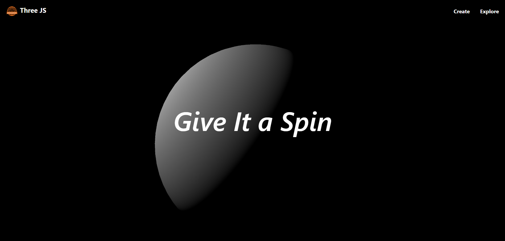

<!DOCTYPE html>
<html lang="en">
<body>
    <h1>Sphere Three.js Animation</h1>

    

    <h2>Description</h2>
    
This project demonstrates a dynamic web application built with React and Three.js, using Vite for fast development and optimized builds. It features a rotating sphere animation implemented with Three.js, showcasing interactive 3D graphics directly in the browser.

    <h2>Features</h2>
    <ul>
        <li><strong>Three.js Integration:</strong> Utilizes Three.js for creating 3D graphics and animations.</li>
        <li><strong>Responsive Design:</strong> Media queries adjust camera positions and sphere rendering based on screen width.</li>
        <li><strong>GSAP Animations:</strong> Integrates GSAP for smooth animations and transitions.</li>
        <li><strong>Asset Management:</strong> Demonstrates best practices for managing assets like images and styles.</li>
    </ul>

    <h2>Installation</h2>
    <ol>
        <li>Clone the repository:
            <pre><code>git clone https://github.com/your-username/sphere-threejs-animation.git</code></pre>
        </li>
        <li>Install dependencies:
            <pre><code>cd sphere-threejs-animation npm install</code></pre>
        </li>
        <li>Start the development server:
            <pre><code>npm run dev</code></pre>
        </li>
        <li>Open your browser and navigate to <code>http://localhost:3000</code> to view the application.</li>
    </ol>

    <h2>Usage</h2>
    <ul>
        <li>Explore the rotating sphere animation by interacting with the application.</li>
        <li>Experiment with different screen sizes to see responsive adjustments in action.</li>
    </ul>

    <h2>Technologies Used</h2>
    <ul>
        <li>React</li>
        <li>Three.js</li>
        <li>Vite</li>
        <li>GSAP</li>
    </ul>

    <h2>Contributing</h2>
    
Contributions are welcome! Feel free to open issues and pull requests.

    <h2>License</h2>
    
This project is licensed under the MIT License - see the <a href="LICENSE">LICENSE</a> file for details.

    

    <footer>
        Created by Your Name &ndash; <a href="https://github.com/your-username">GitHub Profile</a>
    </footer>
</body>

</html>
